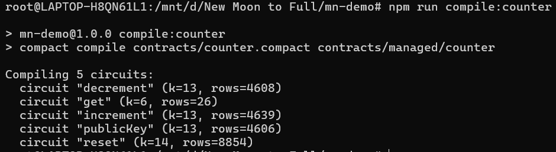
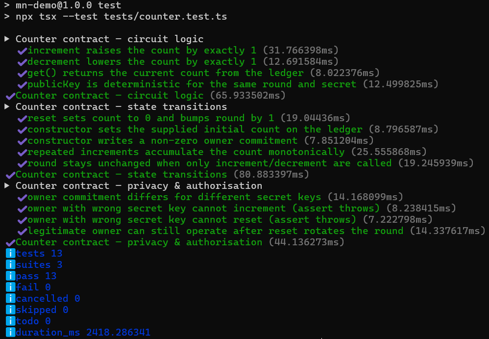
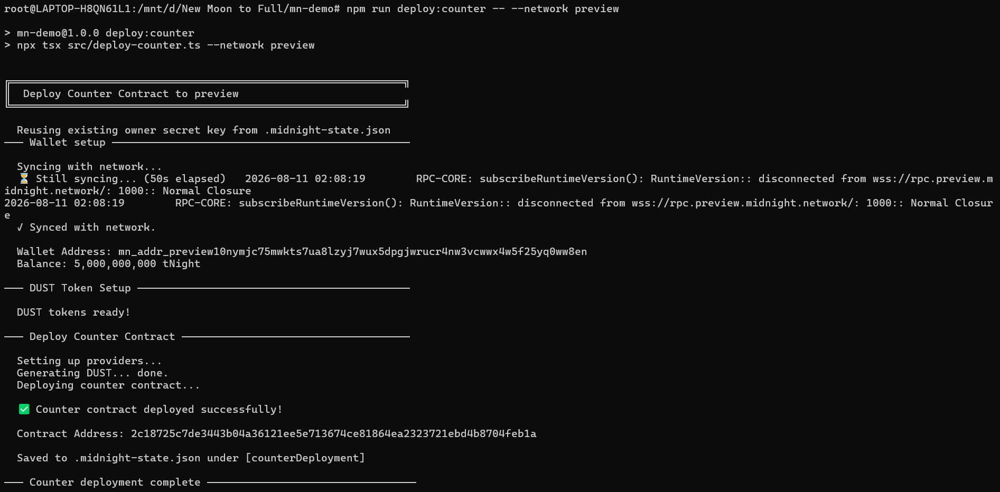
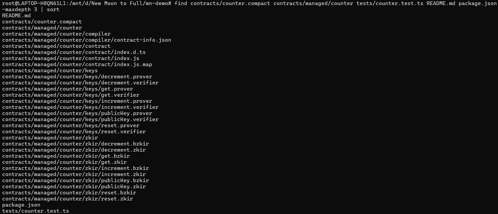

# Anonity


> Anonymous bug bounties on Midnight: hunters prove they're owed a payout without ever revealing who they are.

---

## Live Demo

**URL:** https://an0n1ty.vercel.app/

Connect your wallet and use the Anonity bounty board live on Preprod.

---

## Contract Address

| Network  | Address                                                                 |
|----------|-------------------------------------------------------------------------|
| Preprod (Anonity bounty core) | `4f8c327a9c86de19c64b8b09b81855d1c57670a774af769bd890cd110c2bff37` |
| Preprod (counter, L2 demo)     | `63bfa0aec1cd8f8a768487dfd72fa5fc5e90bc311c9873006af30b694ab8cd7b` |
| Preview (counter, L1)          | `8aab69118bde5a18cae92def5d7a933e3c3059998619242285ea7d34b5b1abb8` |

---

## What This Product Does

Bug bounty platforms have an identity problem. Security researchers must disclose who they are to get paid, which exposes them to retaliation, doxxing, and legal risk. Organizations can't verify that reports come from distinct, serious researchers rather than one spammer with ten email addresses. And everyone pays middleman fees for trust that cryptography could provide directly.

**Anonity** fixes both sides. Organizations post bounties; researchers submit vulnerability reports anonymously; every submission carries a 5 NIGHT anti-spam fee received as a shielded contract output. Report content and triage messages are sealed in the browser for the organization and the hunter separately. Payment rights are proof-gated, not account-gated.

This repo ships the privacy core of **Anonity**: the bounty contract (`contracts/anonity.compact`) with program posting, anonymous submission with shielded fee escrow, org-only resolution across three outcomes, and a proof-gated shielded payout claim circuit — plus a React frontend wired to Preprod. The configured Supabase project has the private-report schema applied. The final qualified-coin handoff for claim UX, updated-contract redeployment, and end-to-end wallet/privacy tests are still required before this is presented as production-ready.

---

## Privacy Model

- **PUBLIC (on-chain, anyone can see):** bounty amounts and deadlines; that a submission exists against a bounty; resolution outcomes (valid / duplicate / slop); aggregate fee accounting (escrowed, forfeited, refunded, paid); identity *commitments* (one-way hashes).
- **PRIVATE (private witness or sealed off-chain data):** each participant's 32-byte secret key; the link between any commitment and any wallet address; report and comment bodies; payout recipient address and account identity.
- **What the user PROVES without revealing:** that the org resolving a submission owns the bounty commitment, and that the hunter claiming a valid payout owns the matching hunter secret. Supabase can route ciphertext but cannot decrypt it with its database credentials.
- **LIMITATION:** browser, hosting, wallet, and network operators can still observe request metadata such as timing and IP address. Anonity does not provide connection-level anonymity.

### Observer boundary

| Observer | Can learn | Cannot learn from the platform data alone |
|----------|-----------|--------------------------------------------|
| Supabase/database operator | Public IDs, timestamps, ciphertext, and organization metadata | Report text, triage bodies, hunter secret, or the hunter-to-wallet link |
| Chain observer | Bounty/submission commitments, outcomes, and public transaction data | The secret behind a commitment or a plaintext report; shielded recipients are not stored as report payout addresses |
| Hosting/network operator | Browser request timing and source IP | The cryptographic identity that owns a hunter commitment |
| Correct organization | Its own decrypted reports and triage thread | The hunter's real-world identity or funding-wallet identity |

This is a cryptographic/application privacy boundary, not connection-level anonymity. A compelled or leaked hosting, wallet, or network log may still correlate timing and IP data.

---

## Tech Stack

- **Midnight network** (Preprod)
- **Compact language** — ZK smart contracts (`anonity.compact`, `counter.compact`)
- **Midnight.js SDK** — DApp Connector API, proof providers, indexer
- **React 19 + Vite 7 + TypeScript** — frontend
- **Lace / 1AM wallets** — browser wallets with wallet-delegated proving
- **Node.js v22**, **Docker** (local proof server), **Vercel** (hosting), **GitHub Actions** (CI)

---

## Prerequisites

1. **Node.js v22+**
2. **Lace** (or 1AM) browser wallet extension
3. **Docker** — only for the local proof server (Lace users; 1AM proves in-browser)
4. **Compact compiler** — only if you need to recompile contracts
5. **WSL2** on Windows

---

## Setup & Run Locally

```bash
# 1. Clone
git clone https://github.com/ayaan-there/Anonity.git
cd mn-demo

# 2. Install
npm install

# 3. Recompile contracts (optional — artifacts are committed)
npm run compile
npm run compile:anonity

# 4. Start the local proof server (only needed for Lace wallet)
npm run proof-server:start

# 5. Run the dev server
npm run dev
```

Open the URL printed by Vite (your current local preview is http://localhost:4173), connect your wallet, and use the bounty board.

Deploy the contract yourself with:

```bash
npm run deploy:anonity -- --network preprod
```

After deployment, set `VITE_ANONITY_CONTRACT` to the printed address and deploy the chain-gated report writer:

```bash
supabase functions deploy store-report --project-ref <supabase-project-ref>
supabase secrets set --project-ref <supabase-project-ref> ANONITY_CONTRACT_ADDRESS=<new-contract-address>
```

The function uses the public Midnight indexer to verify a finalized `submitReport` action before it writes ciphertext with the server-side database role. Never put the service-role key in frontend environment variables.

Deployment state and wallet seeds stay in the ignored `.midnight-state.json` file. Never commit that file or paste its contents into documentation, issues, or logs.

### Recording-only transparent demo

For a temporary recording when the wallet has no shielded NIGHT, deploy the isolated transparent contract:

```bash
npm run deploy:anonity-demo
```

Set these Vercel build-time variables for the recording deployment:

```text
VITE_PAYMENT_MODE=unshielded-demo
VITE_ANONITY_DEMO_CONTRACT=<printed-demo-address>
```

Keep `VITE_ANONITY_CONTRACT` set to the normal shielded contract. The demo contract uses transparent unshielded NIGHT for the 5 NIGHT submission fee and valid payout; this mode is not privacy-preserving and must not be presented as the production privacy deployment. Set `VITE_PAYMENT_MODE` back to `shielded` (or remove it) when recording is complete.

The `store-report` Edge Function must also be redeployed with `ANONITY_DEMO_CONTRACT_ADDRESS` set to the demo address. It accepts only the configured shielded and demo contract addresses while keeping report content encrypted.

---

## Run Tests

```bash
npm test
```

40 tests across 8 suites — circuit logic, state transitions, and privacy/authorization for both contracts, all on the local emulator (no network needed).

---

## CI/CD

Every push and pull request to `main` runs [.github/workflows/ci.yml](.github/workflows/ci.yml): install → Compact compile of both contracts → emulator suite → typecheck → production build. The badge at the top of this README shows the current status.

---

## Usage Guide

See [docs/USAGE.md](docs/USAGE.md) for a plain-English walkthrough: posting bounties, submitting anonymous reports, resolving outcomes, and what stays private at every step.

---

## Screenshots

### Contract compilation



### Test suite



### Contract deployment



### Repository



---

## Product X Profile

[@ANONITYik9o](https://x.com/ANONITYik9o)
